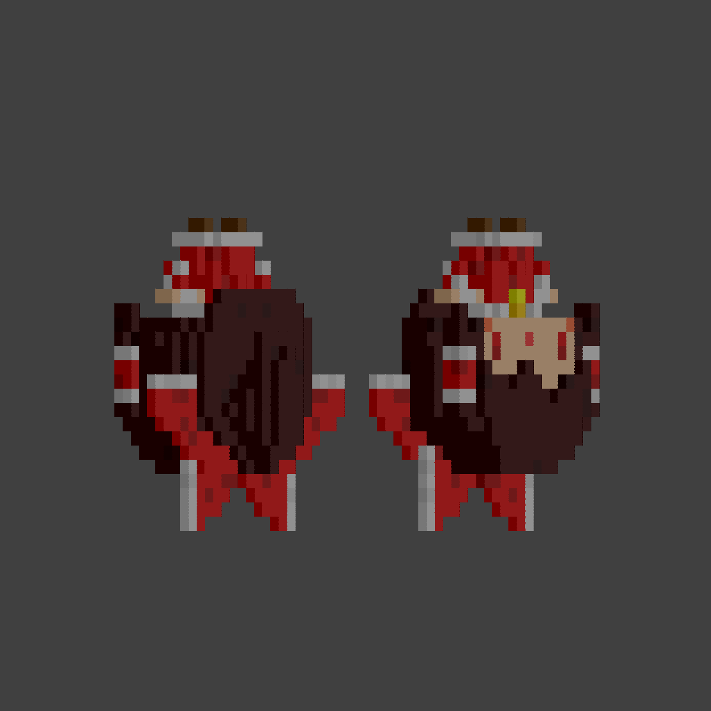
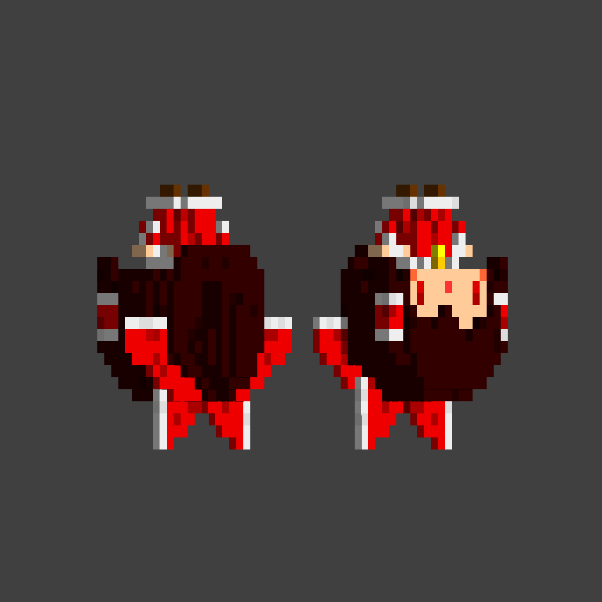

最近发现了一个软光栅教程，教程最终会渲染为图片，当然也可以很轻松的用作互动视频，原教程还有很多的优化点，我这里实现的比较粗糙就先以实现效果为主，没有做太多优化。
 原教程：https://github.com/ssloy/tinyrenderer/wiki/Lesson-0:-getting-started
 线性代数：https://www.bilibili.com/video/av6731067/?p=4&spm_id_from=333.788.0.0&vd_source=923fe31a18e5b835f6cc1eeb2a08340b
 java实现软光栅：https://space.bilibili.com/3493092766255793/video
 games101：https://www.bilibili.com/video/BV1X7411F744?t=1168.5&p=9
 视频：https://www.bilibili.com/video/BV1E4421X7bV/
 简单上色

添加阴影

添加光照
